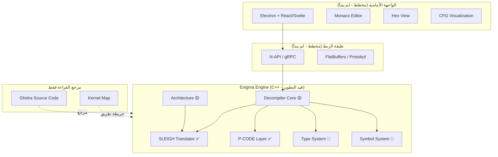
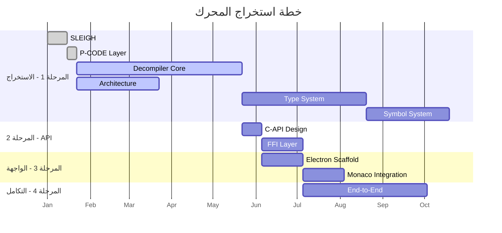
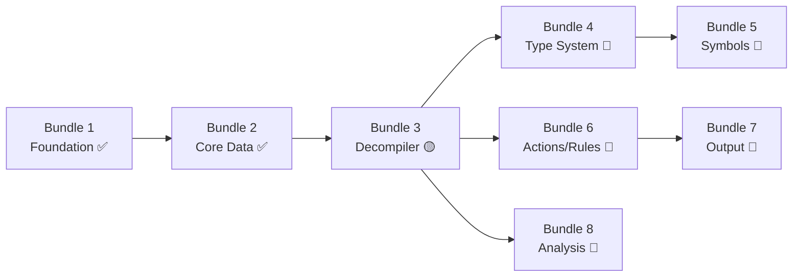

-Architecture Principle: Enigma is a Java-free, Ghidra-compatible C++ port. Use original Ghidra components directly when they already exist in C/C++ (Decompiler, SLEIGH, language specs, p-code pieces, etc.). Translate Java components to C++ only when needed to remove Java. Do NOT replace mature Ghidra components with from-scratch rewrites unless there is a clear technical reason and the user agrees.

-Decompiler Principle: The official first-version decompiler core is the original Ghidra C++ decompiler under `Enigma-Engine/decompiler/`, exposed through `enigma_decompile_full`. Improve and patch this core directly when needed. The Enigma-native/Capstone path is experimental/supporting work, not the main product decompiler for the first version.

-Building and working according to Ghidra source code, Always keep in mind classes/memory management
/pointers.... use the best java alternative in c++,Our goal is to get rid of Java completely.

-Always test after any set of change,Fix the problems before continue.

-The program will RUN on ALL Platforms Win/Linux/Mac.

-Always rely on "ghidra source code" for working, ALWAYS.compare the java files then create c++ files.

-Try to Ignore writing COMMENTS in code except the Necessary Ones.

-The UI/plugin.system java files is the last thing we gone change.

-UI/Plugin Decision: We use Qt. 

-always Make atentions to file association Make sure EVERYTHING is CONNECT PERFECTLY as the 
original Ghidra.

-Always Update "PROGRESS.md" file after any set of changes.

-We will use Direct Ready COMPONENTS like Decompiler/deassembler/loader/Pcode...check "COMPONENTS.md" and "GHIDRA MAIN SCHEMA.md" files and other files to understand.

-Remind me if we get into sensitive parts or MAIN COMPONENTS that we need,and remind me if we finish working on whole COMPONENT,

-Ask me if you're ever confused and don't know how to handle a problem; always.

//Ghidra Schema
┌─────────────────────────────────────────────────────┐
│                    المستخدم / UI                       │   
└──────────────────────┬──────────────────────────────┘
                       │
┌──────────────────────▼──────────────────────────────┐
│                  Program Model                      │
│          (الصورة الكاملة للبرنامج المحلَّل في الذاكرة)                |
│  Program, Memory, SymbolTable, FunctionManager      │
└──┬───────────┬───────────┬──────────────┬───────────┘
   │           │           │              │
┌──▼──┐   ┌───▼───┐  ┌────▼────┐  ┌─────▼─────┐
│     │   │       │  │         │  │           │   //We should use directly
│Lodr │   │Disasm │  │ Pcode   │  │Decompiler │
│     │   │       │  │ Engine  │  │           │
└──┬──┘   └───┬───┘  └────┬────┘  └─────┬─────┘
   │          │           │             │
   │      ┌────▼────┐ ┌───▼────┐        │
   │      │ Sleigh  │ │ Varnode│        │
   │      │(تعريف    │ │ /Pcode │        │        //also this
   │      │المعمار)    │ │  IR    │        │
   │      └─────────┘ └────────┘        │
   │                                    │
┌──▼────────────────────────────────────▼─────────┐
│              Binary File (ELF/PE/Mach-O)        │
└─────────────────────────────────────────────────┘

//Explain
# 🔍 تحليل شامل لمشروع Enigma IDE

## نظرة عامة

**Enigma IDE** هو مشروع طموح يهدف إلى بناء بيئة تطوير متكاملة (IDE) للهندسة العكسية (Reverse Engineering)، مبنية على استخراج محرك Ghidra's Decompiler من كوده الأصلي (C++) وتحويله إلى مكتبة مستقلة تُغذّي واجهة Electron حديثة.

---

## 🏗️ البنية المعمارية



---

## 📁 هيكل المشروع

| المجلد | الوصف | الحجم |
|--------|-------|-------|
| [PLAN/](file:///c:/Users/pc/Desktop/Enigma%20IDE%20Local/PLAN) | وثائق التخطيط والتقدم والتحليل | 7 ملفات |
| [enigma-engine/](file:///c:/Users/pc/Desktop/Enigma%20IDE%20Local/enigma-engine) | المحرك الأساسي C++ | 7 أقسام فرعية |
| [ghidra-kernel-map/](file:///c:/Users/pc/Desktop/Enigma%20IDE%20Local/ghidra-kernel-map) | خريطة اعتماديات Ghidra | 49 عقدة + 420 حافة |
| [ghidra-source code/](file:///c:/Users/pc/Desktop/Enigma%20IDE%20Local/ghidra-source%20code) | الكود المرجعي لـ Ghidra (للقراءة فقط) | مستودع كامل |

---

## 🔧 تحليل المحرك (enigma-engine)

### الملفات المصدرية المُنجزة

| الملف | السطور (تقريبياً) | الحالة | الوصف |
|-------|----------|--------|-------|
| [address.h](file:///c:/Users/pc/Desktop/Enigma%20IDE%20Local/enigma-engine/include/enigma/address.h) + [.cpp](file:///c:/Users/pc/Desktop/Enigma%20IDE%20Local/enigma-engine/src/address.cpp) | ~90 | ✅ مكتمل | فضاءات العناوين وكائن Address |
| [varnode.h](file:///c:/Users/pc/Desktop/Enigma%20IDE%20Local/enigma-engine/include/enigma/varnode.h) + [.cpp](file:///c:/Users/pc/Desktop/Enigma%20IDE%20Local/enigma-engine/src/varnode.cpp) | ~100 | ✅ مكتمل | وحدة البيانات الأساسية في P-CODE |
| [pcode.h](file:///c:/Users/pc/Desktop/Enigma%20IDE%20Local/enigma-engine/include/enigma/pcode.h) + [.cpp](file:///c:/Users/pc/Desktop/Enigma%20IDE%20Local/enigma-engine/src/pcode.cpp) | ~250 | ✅ مكتمل | 72 عملية P-CODE كاملة |
| [block.h](file:///c:/Users/pc/Desktop/Enigma%20IDE%20Local/enigma-engine/include/enigma/block.h) + [.cpp](file:///c:/Users/pc/Desktop/Enigma%20IDE%20Local/enigma-engine/src/block.cpp) | ~130 | ✅ مكتمل | CFG + خوارزمية Dominator |
| [architecture.h](file:///c:/Users/pc/Desktop/Enigma%20IDE%20Local/enigma-engine/include/enigma/architecture.h) + [.cpp](file:///c:/Users/pc/Desktop/Enigma%20IDE%20Local/enigma-engine/src/architecture.cpp) | ~120 | 🟡 جزئي | x86-64 فقط، loadSleighFile = stub |
| [decompiler.h](file:///c:/Users/pc/Desktop/Enigma%20IDE%20Local/enigma-engine/include/enigma/decompiler.h) + [funcdata.cpp](file:///c:/Users/pc/Desktop/Enigma%20IDE%20Local/enigma-engine/decompiler/src/funcdata.cpp) | ~100 | 🟡 جزئي | الهيكل موجود، 6 مراحل كلها stubs |
| [types.h](file:///c:/Users/pc/Desktop/Enigma%20IDE%20Local/enigma-engine/include/enigma/types.h) | ~50 | 🔴 هيكل فقط | Placeholder لنظام الأنواع |

### نظام SLEIGH المُستخرج

```
sleigh/
├── include/sleigh/ (9 headers)
│   ├── context.h, float_format.h, opbehavior.h
│   ├── pcoderaw.h, semantics.h, sleigh.h
│   ├── sleighbase.h, space.h, translate.h
└── src/ (9 source files)
    ├── context.cpp, float_format.cpp, opbehavior.cpp
    ├── pcoderaw.cpp, semantics.cpp, sleigh.cpp
    ├── sleighbase.cpp, space.cpp, translate.cpp
```

> [!TIP]
> نظام SLEIGH هو الجزء الأكثر نضجاً - مُستخرج بالكامل ويُبنى بشكل مستقل.

### الاختبارات

4 ملفات اختبار باستخدام Google Test:
- [test_address.cpp](file:///c:/Users/pc/Desktop/Enigma%20IDE%20Local/enigma-engine/tests/test_address.cpp) – اختبارات فضاءات العناوين
- [test_pcode.cpp](file:///c:/Users/pc/Desktop/Enigma%20IDE%20Local/enigma-engine/tests/test_pcode.cpp) – اختبارات عمليات P-CODE
- [test_varnode.cpp](file:///c:/Users/pc/Desktop/Enigma%20IDE%20Local/enigma-engine/tests/test_varnode.cpp) – اختبارات Varnode
- [test_block.cpp](file:///c:/Users/pc/Desktop/Enigma%20IDE%20Local/enigma-engine/tests/test_block.cpp) – اختبارات CFG والـ Dominators

---

## 📊 تقدم المشروع



### ملخص الإنجاز

| المقياس | الحالي | الهدف | النسبة |
|---------|--------|-------|--------|
| ملفات Ghidra المُستخرجة | ~25 | 86 | **29%** |
| عمليات P-CODE | 72 | 72 | **100%** |
| مراحل الـ Decompiler | 2/8 | 8 | **25%** |
| المعماريات | 1 (x86) | 4 | **25%** |
| دوال C-API | 0 | ~30 | **0%** |
| واجهات Frontend | 0 | 6 | **0%** |

---

## 🗺️ خريطة الاعتماديات (Kernel Map)

تم بناء خريطة شاملة لكل ملفات Ghidra's Decompiler:

- **49 عقدة** (node) – كل عقدة تمثل ملف مصدري مع توثيق دوره واعتمادياته
- **~420 حافة** (edge) – كل حافة تمثل علاقة `#include`
- **أكثر ملف اتصالاً**: `funcdata.hh` (مُستخدم من 18 ملف)

### ترتيب الاستخراج (Task Bundles)



---

## ⚠️ المخاطر والتحديات

> [!CAUTION]
> ### مخاطر عالية
> 1. **Heritage Pass (SSA)** – ~3,000 سطر، متشابك بشدة مع Funcdata ونظام الأنواع. أعقد مكوّن منفرد.
> 2. **Action/Rule System** – ~15,000 سطر عبر 20+ ملف، ترتيب تطبيق معقد.
> 3. **Type Inference** – يلمس تقريباً كل نظام فرعي آخر.

> [!WARNING]
> ### مخاطر متوسطة
> 4. **Memory Provider** – يجب استبدال وصول Java-side بـ I/O أصلي.
> 5. **Symbol Database** – تصميم مخطط جديد متوافق مع توقعات الـ Decompiler.
> 6. **Jump Table Analysis** – هيوريستيات معقدة، خاصة بكل معمارية.

> [!NOTE]
> ### مخاطر منخفضة
> 7. **SLEIGH** – مُستخرج ويعمل بالفعل.
> 8. **P-CODE** – تعريفات مستقلة.
> 9. **Print/Output** – مُكتفٍ ذاتياً بعد عمل الـ pipeline.

---

## 📐 جودة الكود

### نقاط القوة ✅
- **بنية واضحة**: فصل نظيف بين الـ headers والـ sources
- **تسمية متسقة**: namespace `enigma` مع تسمية CamelCase
- **C++ حديث**: استخدام `std::unique_ptr`, `enum class`, `override`
- **اختبارات**: Google Test مع FetchContent للتبعيات
- **CMake منظم**: هيكل multi-target مع subdirectories
- **توثيق ممتاز**: خريطة اعتماديات شاملة وتتبع تقدم مفصل

### نقاط تحتاج تحسين ⚡
- **الـ Stubs كثيرة**: 6 من 8 مراحل decompiler هي stubs
- **`loadSleighFile`** يُعيد `false` دائماً – لم يتم ربطه بـ SLEIGH الفعلي
- **لا يوجد error handling** منظم (لا exceptions, لا error codes)
- **لا يوجد logging framework** – يستخدم `std::cout` فقط
- **`codeSpace` و `dataSpace`** كلاهما "ram" بنفس الـ index – قد يسبب مشاكل
- **لا يوجد CI/CD** – لا ملف GitHub Actions أو مكافئ

---

## 🎯 التوصيات

### الأولوية القصوى (الآن)
1. **إكمال Heritage Pass** – هذا هو عنق الزجاجة. بدونه لا يمكن للـ decompiler إنتاج أي ناتج مفيد.
2. **ربط SLEIGH بـ Architecture** – `loadSleighFile()` يجب أن يعمل فعلياً لتحميل ملفات `.sla`.
3. **إضافة Error Handling** – نظام `Result<T>` أو exceptions مع فئات خطأ محددة.

### الأولوية العالية (قريباً)
4. **Bundle 4: Type System** – التالي في ترتيب الاستخراج وضروري للـ Heritage.
5. **إضافة Logging** – استبدال `std::cout` بـ `spdlog` أو مكتبة مماثلة.
6. **Integration Test** – اختبار end-to-end: `bytes → SLEIGH → P-CODE → CFG`.

### الأولوية المتوسطة (لاحقاً)
7. **تصميم C-API** – البدء بالتفكير في الـ API surface قبل أن يتشابك الكود أكثر.
8. **CI/CD** – GitHub Actions مع build + test على كل PR.
9. **التوثيق** – Doxygen comments على الـ public API.

---

## 📈 الجدول الزمني المُقدّر

| المرحلة | المدة | الحالة |
|---------|-------|--------|
| استخراج SLEIGH | أسبوعان | ✅ مُنجز |
| طبقة P-CODE | أسبوع | ✅ مُنجز |
| نواة الـ Decompiler | 3-4 أشهر | 🟡 قيد التنفيذ |
| تصميم C-API | أسبوعان | 🔴 لم يبدأ |
| هيكل Electron | شهر | 🔴 لم يبدأ |
| Analysis Passes | 6-8 أشهر | 🔴 لم يبدأ |


---

## 🔑 القواعد الحرجة (من VERY IMPORTANT.md)

> [!IMPORTANT]
> 1. **لا تعدّل كود Ghidra مباشرة** – مجلد `ghidra-source code/` للقراءة فقط
> 2. **خريطة الـ Kernel هي المخطط** – راجع `ghidra-kernel-map/` قبل أي استخراج
> 3. **كل class = PR واحد** – لا تجمع classes غير مرتبطة
> 4. **C-API يجب أن يكون مستقراً** – لا تغيير signatures بدون deprecation
> 5. **لا تُعدّل SLEIGH** – يعمل بالفعل، لا تلمسه إلا لإصلاح bugs


# إعادة كتابة نواة غيدرا بـ C++ - التحليل والقواعد

## الهدف

إعادة كتابة نواة غيدرا (Kernel) من Java إلى C++ بشكل تدريجي، ملف بملف.
نفس الأداة. نفس المنطق. نفس الوظائف. لغة مختلفة.

---

## الأرقام

| المقياس | القيمة |
|---|---|
| عقد الـ Kernel في الـ Map | **4,852 عقدة** |
| روابط التبعية | **21,441 رابطة** |
| ملفات UI (لن تُلمس الآن) | ~1,293 (Test/Dialog/Panel/Theme/Help/Graph) |
| الملفات المستهدفة للترجمة | **~3,559 ملف** |

---

## منهجية العمل

```
لكل ملف Java في الـ Kernel:
  1. أقرأ node الملف من ghidra-kernel-map/nodes/ → أفهم تبعياته
  2. أتحقق من edges.md → أفهم من يعتمد عليه ومن يعتمد هو عليه
  3. أقرأ الكود المصدري Java الأصلي بالكامل
  4. أكتب نسخة C++ مطابقة تحافظ على نفس المنطق
  5. أنتقل للملف التالي حسب الترتيب الطوبولوجي
```

الترتيب: أبدأ من الأوراق (ملفات بدون تبعيات) وأصعد تدريجياً.

---

## قواعد الترجمة: Java → C++

### 1. الكلاسات (Classes)

```java
// ──── Java ────
public class Address implements Comparable<Address> {
    private AddressSpace addrSpace;
    private long offset;

    public Address(AddressSpace space, long offset) {
        this.addrSpace = space;
        this.offset = offset;
    }

    public AddressSpace getAddressSpace() { return addrSpace; }
    public long getOffset() { return offset; }
}
```

```cpp
// ──── C++ ────
class Address {
private:
    AddressSpace* addrSpace;
    int64_t offset;

public:
    Address(AddressSpace* space, int64_t offset)
        : addrSpace(space), offset(offset) {}

    AddressSpace* getAddressSpace() const { return addrSpace; }
    int64_t getOffset() const { return offset; }

    // Comparable<Address> → operator<
    bool operator<(const Address& other) const;
    bool operator==(const Address& other) const;
};
```

**القاعدة:**
- `public class X` → `class X`
- `this.field` → حقل عادي
- `implements Comparable<T>` → `operator<` و `operator==`
- الـ constructor يبقى كما هو مع initialization list

---

### 2. الـ Interfaces

```java
// ──── Java ────
public interface TaskMonitor {
    boolean isCancelled();
    void setMessage(String msg);
    void setProgress(long value);
    void checkCancelled() throws CancelledException;
}
```

```cpp
// ──── C++ ────
class TaskMonitor {
public:
    virtual ~TaskMonitor() = default;

    virtual bool isCancelled() const = 0;
    virtual void setMessage(const std::string& msg) = 0;
    virtual void setProgress(int64_t value) = 0;
    virtual void checkCancelled() = 0;  // يرمي CancelledException
};
```

**القاعدة:**
- `interface` → `class` مع `virtual ... = 0`
- كل interface يحصل على `virtual ~Destructor() = default`
- `throws X` → توثيق بتعليق (C++ لا تفرض checked exceptions)

---

### 3. الـ Abstract Classes

```java
// ──── Java ────
public abstract class AbstractDataType implements DataType {
    protected String name;
    protected DataTypeManager dataMgr;

    protected AbstractDataType(String name, DataTypeManager mgr) {
        this.name = name;
        this.dataMgr = mgr;
    }

    @Override
    public String getName() { return name; }

    public abstract int getLength();
}
```

```cpp
// ──── C++ ────
class AbstractDataType : public DataType {
protected:
    std::string name;
    DataTypeManager* dataMgr;

    AbstractDataType(const std::string& name, DataTypeManager* mgr)
        : name(name), dataMgr(mgr) {}

public:
    std::string getName() const override { return name; }

    virtual int getLength() const = 0;
};
```

**القاعدة:**
- `abstract class` → `class` مع `= 0` للدوال المجردة
- `extends X implements Y` → `: public X, public Y`
- `@Override` → `override`
- `protected` يبقى `protected`

---

### 4. إدارة الذاكرة والمؤشرات

#### القاعدة الذهبية: من يملك الكائن؟

```
┌─────────────────────────────────────────────────────────┐
│              قواعد الملكية (Ownership Rules)              │
├─────────────────────────────────────────────────────────┤
│                                                         │
│  الكائن له مالك واحد → std::unique_ptr<T>              │
│  الكائن مشترك بين عدة أطراف → std::shared_ptr<T>       │
│  مرجع بدون ملكية (مراقبة فقط) → T* (مؤشر خام)         │
│  مرجع مؤقت داخل دالة → T& (مرجع)                      │
│                                                         │
└─────────────────────────────────────────────────────────┘
```

```java
// ──── Java (GC يتكفل بكل شيء) ────
public class ProgramDB {
    private MemoryMapDB memoryManager;
    private CodeManager codeManager;
    private FunctionManagerDB functionManager;

    public ProgramDB(...) {
        memoryManager = new MemoryMapDB(...);
        codeManager = new CodeManager(...);
        functionManager = new FunctionManagerDB(...);
    }
    // لا حاجة لتحرير الذاكرة - الـ GC يفعلها
}
```

```cpp
// ──── C++ (ملكية صريحة) ────
class ProgramDB {
private:
    // ProgramDB يملك هذه الكائنات → unique_ptr
    std::unique_ptr<MemoryMapDB> memoryManager;
    std::unique_ptr<CodeManager> codeManager;
    std::unique_ptr<FunctionManagerDB> functionManager;

public:
    ProgramDB(...) {
        memoryManager = std::make_unique<MemoryMapDB>(...);
        codeManager = std::make_unique<CodeManager>(...);
        functionManager = std::make_unique<FunctionManagerDB>(...);
    }
    // الـ destructor التلقائي يحرر كل شيء
    ~ProgramDB() = default;
};
```

#### متى نستخدم كل نوع:

| النمط في Java | الترجمة في C++ | السبب |
|---|---|---|
| `X obj = new X()` في constructor | `std::unique_ptr<X>` | المالك ينشئه ويملكه |
| حقل يُمرر من الخارج ويُخزّن | `T*` (مؤشر خام) | لا يملكه، فقط يشير إليه |
| كائن يتشارك فيه عدة managers | `std::shared_ptr<T>` | ملكية مشتركة |
| متغير محلي مؤقت | `T` على الـ stack أو `T&` | لا حاجة لـ heap |
| `return new X()` | `return std::make_unique<X>()` | نقل الملكية |
| `List<X>` حقل | `std::vector<std::unique_ptr<X>>` أو `std::vector<X>` | حسب نوع العناصر |

---

### 5. الاستثناءات (Exceptions)

```java
// ──── Java ────
public class CancelledException extends Exception {
    public CancelledException() { super("Operation cancelled"); }
    public CancelledException(String msg) { super(msg); }
}
```

```cpp
// ──── C++ ────
class CancelledException : public std::exception {
private:
    std::string message;
public:
    CancelledException()
        : message("Operation cancelled") {}
    explicit CancelledException(const std::string& msg)
        : message(msg) {}

    const char* what() const noexcept override {
        return message.c_str();
    }
};
```

```java
// ──── Java (استخدام) ────
try {
    monitor.checkCancelled();
} catch (CancelledException e) {
    return;
}
```

```cpp
// ──── C++ (نفس الشيء) ────
try {
    monitor->checkCancelled();
} catch (const CancelledException& e) {
    return;
}
```

**القاعدة:**
- `extends Exception` → `: public std::exception`
- `extends RuntimeException` → `: public std::runtime_error`
- `getMessage()` → `what()`
- `throws X` في تعريف الدالة → لا شيء (توثيق بتعليق فقط)
- `catch (X e)` → `catch (const X& e)`

---

### 6. الـ Collections (المجموعات)

| Java | C++ | ملاحظة |
|---|---|---|
| `ArrayList<T>` | `std::vector<T>` | مطابق |
| `LinkedList<T>` | `std::list<T>` | مطابق |
| `HashMap<K,V>` | `std::unordered_map<K,V>` | hash-based |
| `TreeMap<K,V>` | `std::map<K,V>` | sorted |
| `HashSet<T>` | `std::unordered_set<T>` | hash-based |
| `TreeSet<T>` | `std::set<T>` | sorted |
| `Iterator<T>` | range-based for أو iterators | |
| `List<T>` (interface) | `std::vector<T>` | أبسط بديل |
| `Map<K,V>` (interface) | `std::unordered_map<K,V>` | |
| `Collections.unmodifiableList()` | `const std::vector<T>&` | |

```java
// ──── Java ────
List<Address> addresses = new ArrayList<>();
addresses.add(addr1);
for (Address addr : addresses) { ... }
```

```cpp
// ──── C++ ────
std::vector<Address> addresses;
addresses.push_back(addr1);
for (const auto& addr : addresses) { ... }
```

---

### 7. الأنواع الأساسية

| Java | C++ | ملاحظة |
|---|---|---|
| `boolean` | `bool` | |
| `byte` | `uint8_t` | Java byte is signed, لكن في غيدرا يُستخدم كـ unsigned غالباً |
| `short` | `int16_t` | |
| `int` | `int32_t` | |
| `long` | `int64_t` | |
| `float` | `float` | |
| `double` | `double` | |
| `String` | `std::string` | |
| `BigInteger` | نكتب class مخصص أو نستخدم مكتبة | |
| `null` | `nullptr` | |
| `Object` | `void*` أو template | حسب السياق |

---

### 8. الأنماط الشائعة

#### Getter/Setter
```java
// Java
private String name;
public String getName() { return name; }
public void setName(String name) { this.name = name; }
```
```cpp
// C++
private:
    std::string name_;
public:
    const std::string& getName() const { return name_; }
    void setName(const std::string& name) { name_ = name; }
```

#### Enum
```java
// Java
public enum RefType { DATA, CODE, CALL, JUMP }
```
```cpp
// C++
enum class RefType { DATA, CODE, CALL, JUMP };
```

#### Static Methods
```java
// Java
public class AddressUtils {
    public static boolean isValid(Address addr) { ... }
}
```
```cpp
// C++
class AddressUtils {
public:
    static bool isValid(const Address* addr) { ... }
    AddressUtils() = delete;  // منع إنشاء instance
};
```

#### Singleton
```java
// Java
private static DataTypeManager instance;
public static DataTypeManager getInstance() {
    if (instance == null) instance = new DataTypeManager();
    return instance;
}
```
```cpp
// C++
static DataTypeManager& getInstance() {
    static DataTypeManager instance;
    return instance;
}
```

#### Generics → Templates
```java
// Java
public class PropertyMap<T extends Saveable> {
    private Map<Address, T> map;
    public T get(Address addr) { return map.get(addr); }
}
```
```cpp
// C++
template<typename T>
class PropertyMap {
    static_assert(std::is_base_of_v<Saveable, T>);
    std::unordered_map<Address, T> map_;
public:
    T* get(const Address& addr) {
        auto it = map_.find(addr);
        return (it != map_.end()) ? &it->second : nullptr;
    }
};
```

---

### 9. هيكل الملفات

```
لكل ملف Java واحد → ملفان C++:

  Address.java  →  Address.h    (التعريفات)
                   Address.cpp  (التنفيذ)
```

#### تنظيم الـ includes
```cpp
// Address.h
#pragma once

#include <cstdint>
#include <string>
#include "AddressSpace.h"    // تبعية من الـ Map

namespace ghidra {

class Address {
    // ...
};

} // namespace ghidra
```

**القاعدة:**
- كل شيء داخل `namespace ghidra {}`
- `#pragma once` بدل include guards
- forward declaration كلما أمكن لتقليل الـ includes
- `.h` للتعريفات، `.cpp` للتنفيذ

---

### 10. ما لا نترجمه (في مرحلة الـ Kernel)

| الفئة | السبب |
|---|---|
| ملفات `*Test*` | اختبارات - ليست جزء من النواة |
| ملفات `*Dialog*`, `*Panel*` | واجهة مستخدم |
| ملفات `*Renderer*` | عرض بصري |
| ملفات `*Theme*`, `*LookAndFeel*` | تنسيق بصري |
| ملفات `*Help*` | نظام مساعدة |
| `javax.swing.*` | مكتبة Java UI |
| `java.awt.*` | مكتبة Java UI |

عندما نصادف تبعية على UI class، نضع **stub فارغ** أو نحذف الاستدعاء.

---

## ترتيب التنفيذ

### الموجة 0: البنية التحتية
- هيكل المشروع (CMakeLists.txt, مجلدات)
- الأنواع الأساسية المشتركة (types.h)

### الموجة 1: الاستثناءات (صفر تبعيات)
`CancelledException`, `AssertException`, `NotFoundException`, `LockException`...

### الموجة 2: الأنواع الذرية
`TaskMonitor`, `Msg`, `Callback`, `Disposable`...

### الموجة 3: نموذج العناوين
`AddressSpace`, `Address`, `AddressRange`, `AddressSet`...

### الموجة 4: نموذج البيانات
`DataType`, `DataOrganization`, `Settings`...

### الموجة n: صعوداً حسب الـ Map...

---

## التعامل مع Garbage Collection

### المشكلة

في Java كل `new` لا يحتاج `delete`. الـ GC يتتبع كل كائن ويحذفه عندما لا يشير إليه أحد.
في C++ لا يوجد GC. إذا عملت `new` بدون `delete` = تسريب ذاكرة.

### الحل: RAII + Smart Pointers

**RAII** (Resource Acquisition Is Initialization): الكائن يُحذف تلقائياً عندما يخرج من النطاق.

```cpp
// لا حاجة لـ GC - الذاكرة تُدار تلقائياً
{
    auto obj = std::make_unique<MyObject>();  // إنشاء
    obj->doSomething();
    // ... استخدام ...
}  // ← هنا يُحذف تلقائياً. لا تسريب.
```

### ثلاث حالات فقط - لكل واحدة حل واحد:

#### الحالة 1: كائن يملكه كلاس واحد (90% من الحالات)

```java
// Java
class ProgramDB {
    private MemoryMapDB memoryManager;       // GC يحذفه لاحقاً
    ProgramDB() {
        memoryManager = new MemoryMapDB();
    }
}
```

```cpp
// C++ → unique_ptr (مالك واحد)
class ProgramDB {
    std::unique_ptr<MemoryMapDB> memoryManager;
    ProgramDB() {
        memoryManager = std::make_unique<MemoryMapDB>();
    }
    // ~ProgramDB() يحذف memoryManager تلقائياً
};
```

#### الحالة 2: كائن يُشار إليه من عدة أماكن (8% من الحالات)

```java
// Java
class FunctionDB {
    private Program program;    // يشير لنفس Program الذي يشير إليه آخرون
    FunctionDB(Program p) {
        this.program = p;       // GC يعرف أنه مشترك
    }
}
```

```cpp
// C++ → مؤشر خام (لا يملكه، فقط يشير إليه)
class FunctionDB {
    Program* program;           // لا يملكه - شخص آخر مسؤول عن حذفه
    FunctionDB(Program* p)
        : program(p) {}
    // ~FunctionDB() لا يحذف program
};
```

#### الحالة 3: ملكية مشتركة حقيقية (2% - نادر)

```java
// Java - كائن يعيش طالما أي مرجع يشير إليه
DataType dt = new IntegerDataType();
cache.put(key, dt);
otherCache.put(key2, dt);
// GC يحذفه فقط عندما cache + otherCache يتركانه
```

```cpp
// C++ → shared_ptr (عداد مراجع تلقائي)
auto dt = std::make_shared<IntegerDataType>();
cache[key] = dt;
otherCache[key2] = dt;
// يُحذف تلقائياً عندما آخر shared_ptr يختفي
```

### كيف أحدد أي حالة لكل حقل؟

أقرأ Java وأسأل: **هل هذا الكلاس ينشئ الكائن بنفسه أم يستقبله من الخارج؟**

| أنشأه بـ `new` في constructor/method | → `unique_ptr` |
|---|---|
| استقبله كـ parameter وخزّنه | → `T*` مؤشر خام |
| يتشارك فيه عدة owners بوضوح | → `shared_ptr` |
| متغير محلي مؤقت | → على الـ Stack مباشرة |

### الـ Collections ومحتوياتها

```java
// Java
List<Function> functions = new ArrayList<>();
functions.add(new FunctionDB(...));  // GC يدير الكل
```

```cpp
// C++ - إذا القائمة تملك محتوياتها:
std::vector<std::unique_ptr<Function>> functions;
functions.push_back(std::make_unique<FunctionDB>(...));

// C++ - إذا القائمة تشير فقط (المحتوى مملوك في مكان آخر):
std::vector<Function*> functions;
functions.push_back(existingFunc);

// C++ - إذا القائمة تحتوي كائنات بسيطة (value types):
std::vector<Address> addresses;    // نسخ مباشرة على الـ stack
addresses.push_back(Address(space, 0x1000));
```

---

## بدائل مكتبات Java → مكتبات C++

### الاستخدام الفعلي في الـ Kernel (أرقام من edges.md)

| مكتبة Java | عدد الاستخدامات في الـ Kernel | بديل C++ |
|---|---|---|
| `IOException` | **771** | `std::system_error` / class مخصص |
| `List` | **852** | `std::vector<T>` (STL مدمج) |
| `ArrayList` | **290** | `std::vector<T>` (STL مدمج) |
| `BigInteger` | **254** | **Boost.Multiprecision** `boost::multiprecision::cpp_int` |
| `Iterator` | **441** | C++ iterators + range-based for (مدمج) |
| `Map` | **359** | `std::map` / `std::unordered_map` (STL مدمج) |
| `File` | **344** | `std::filesystem::path` (C++17 مدمج) |
| `StringUtils` | **140** | **Boost.StringAlgo** أو دوال مخصصة |
| `HashMap` | **87** | `std::unordered_map` (STL مدمج) |

### الخريطة الكاملة: كل مكتبة Java → بديلها C++

#### المجموعات (Collections) - STL مدمج، لا حاجة لمكتبة خارجية

```
java.util.ArrayList<T>          →  std::vector<T>
java.util.LinkedList<T>         →  std::list<T>
java.util.HashMap<K,V>          →  std::unordered_map<K,V>
java.util.TreeMap<K,V>          →  std::map<K,V>
java.util.HashSet<T>            →  std::unordered_set<T>
java.util.TreeSet<T>            →  std::set<T>
java.util.LinkedHashMap<K,V>    →  نكتب wrapper بسيط (vector + map)
java.util.Stack<T>              →  std::stack<T>
java.util.Queue<T>              →  std::queue<T>
java.util.Deque<T>              →  std::deque<T>
java.util.PriorityQueue<T>     →  std::priority_queue<T>
java.util.Collections          →  <algorithm> (sort, find, reverse...)
java.util.Arrays               →  <algorithm> + <array>
java.util.Iterator<T>          →  C++ iterators (begin/end)
java.util.stream.*             →  range-based for + <algorithm>
```

#### الإدخال/الإخراج (I/O) - STL + C++17 filesystem

```
java.io.File                   →  std::filesystem::path        (C++17)
java.io.InputStream            →  std::istream
java.io.OutputStream           →  std::ostream
java.io.FileInputStream        →  std::ifstream
java.io.FileOutputStream       →  std::ofstream
java.io.ByteArrayOutputStream  →  std::ostringstream / std::vector<uint8_t>
java.io.IOException            →  class IOException : public std::runtime_error
java.io.Serializable           →  لا حاجة (نكتب serialize/deserialize يدوياً)
java.nio.ByteBuffer            →  std::vector<uint8_t> + offset
java.nio.file.Path             →  std::filesystem::path        (C++17)
java.nio.file.Files            →  std::filesystem              (C++17)
```

#### النصوص والأرقام

```
java.lang.String               →  std::string
java.lang.StringBuilder        →  std::ostringstream
java.math.BigInteger           →  boost::multiprecision::cpp_int
java.math.BigDecimal           →  boost::multiprecision::cpp_dec_float
java.util.regex.Pattern        →  std::regex                   (C++11)
java.text.SimpleDateFormat     →  <chrono> + fmt               (C++20)
```

#### التزامن (Concurrency) - STL مدمج

```
java.lang.Thread               →  std::thread
java.lang.Runnable             →  std::function<void()>
java.util.concurrent.locks     →  std::mutex / std::lock_guard
java.util.concurrent.atomic    →  std::atomic<T>
java.util.concurrent.Future    →  std::future<T>
java.util.concurrent.Executor  →  thread pool مخصص أو BS::thread_pool
synchronized                   →  std::lock_guard<std::mutex>
volatile                       →  std::atomic<T>
```

#### الـ Reflection - بديل يدوي

```
Class.forName(name)            →  Factory pattern + map<string, creator>
instanceof                     →  dynamic_cast<T*>(ptr) != nullptr
.getClass().getName()          →  typeid(obj).name()  أو  string ثابت
```

#### Apache Commons (مكتبة خارجية في Java) → Boost أو STL

```
StringUtils.isBlank()          →  str.empty() || all_of(str, ::isspace)
StringUtils.join()             →  boost::algorithm::join()
StringUtils.split()            →  boost::algorithm::split()
FilenameUtils                  →  std::filesystem::path methods
CollectionUtils                →  <algorithm>
```

### ملخص المكتبات الخارجية C++ المطلوبة

| المكتبة | الغرض | سبب الاختيار |
|---|---|---|
| **C++17 STL** | Collections, filesystem, threads, regex | مدمج، لا تثبيت |
| **Boost.Multiprecision** | بديل `BigInteger` | المعيار الصناعي |
| **Boost.StringAlgo** | بديل `StringUtils` | عمليات نصوص متقدمة |
| **spdlog** | بديل `Msg` / logging | سريع، header-only |
| **nlohmann/json** | JSON parsing (بديل JDOM) | معيار C++ للـ JSON |
| **SQLite3** | بديل قاعدة بيانات غيدرا الداخلية | خفيف، ملف واحد |
| **zlib** | ضغط (موجود فعلاً في كود غيدرا C++) | مستخدم أصلاً |

### ما لا يحتاج مكتبة خارجية (مدمج في C++17)

- ✅ كل Collections (vector, map, set, list...)
- ✅ كل I/O (fstream, filesystem)
- ✅ كل Threading (thread, mutex, atomic, future)
- ✅ Regex
- ✅ Smart Pointers (unique_ptr, shared_ptr)
- ✅ Optional, Variant, Any
- ✅ String operations أساسية

---

## ملخص: لماذا GC ليست مشكلة حقيقية

| في Java | في C++ | النتيجة |
|---|---|---|
| GC يتتبع كل كائن | Smart pointers تفعل نفس الشيء | ✅ نفس السلوك |
| GC يوقف البرنامج أحياناً (STW pause) | Smart pointers لا توقف شيئاً | ✅ C++ أفضل |
| GC يستهلك ذاكرة إضافية | Smart pointers تكلفة صفر تقريباً | ✅ C++ أفضل |
| مبرمج Java لا يفكر بالذاكرة | مبرمج C++ يحدد الملكية بوضوح | ⚠️ عمل إضافي عند الترجمة |

القاعدة بسيطة: **أنشأته = تملكه = `unique_ptr`. استقبلته = لا تملكه = `T*`.**
